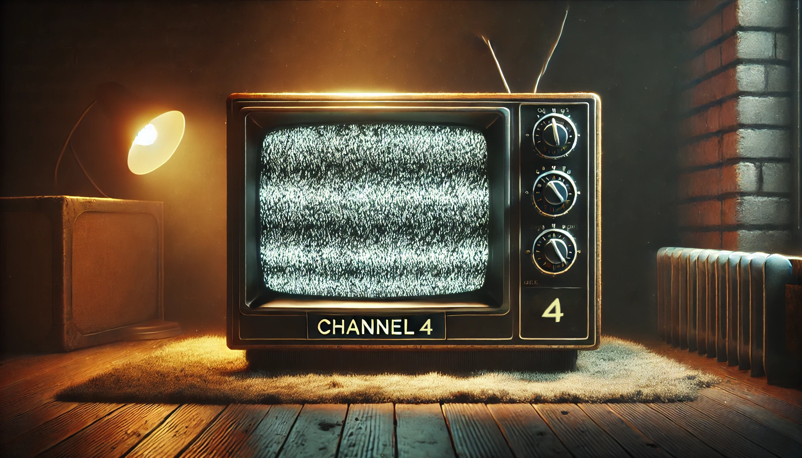

# Channel4 v0.11



A [Groovy](https://groovy-lang.org/) script for [ImageJ/Fiji](https://imagej.net/software/fiji/) that automates selection of microscopy images from Volocity files and then performs channel-based deconvolution, Z-projection, local maxima detection, and binary mask generation on those images. This script uses [Bio-Formats](https://www.openmicroscopy.org/bio-formats/) for file import and the [DeconvolutionLab2](https://github.com/Biomedical-Imaging-Group/DeconvolutionLab2) plugin for deconvolution.

The goal is identification of subcellular focus formation of fluorescently tagged proteins.
This script identifies foci positions in the XY plane, and results are fed in to a Matlab
script for Z positioning and reporting of distances.

---

## Table of Contents
1. [Features](#features)  
2. [Requirements](#requirements)  
3. [Installation](#installation)  
4. [Usage](#usage)  
5. [Script Parameters & Workflow](#script-parameters--workflow)  
6. [Outputs](#outputs)  
7. [Notes & Tips](#notes--tips)  
8. [License](#license)

---

## Features

- **Metadata parsing**: Reads image metadata using Bio-Formats in “metadata only” mode.  
- **Series selection**: Prompts the user to pick which series (by name) to process.  
- **Automated Channel Processing**: The script splits the input image into separate channels and processes each for deconvolution.
- **Deconvolution**: Uses the DeconvolutionLab2 plugin to run Richardson-Lucy deconvolution with user-specified PSF files.
- **Z-Projection**: Generates a maximum-intensity projection (MIP) for each channel.
- **Local Maxima Detection**: Identifies bright spots (maxima) in each channel, saving the coordinates for later analysis.
- **Channel-specific workflows**:
  - **Red** channel: Optionally blurred before finding maxima to reduce noise.  
  - **Blue** channel: Thresholded to produce a binary mask using a user-chosen threshold method (e.g., Otsu).
- **File output**: Saves results in structured subfolders, including deconvolved images, projections, CSV files of found maxima, and binary masks.

---

## Dependencies

1. **ImageJ or Fiji**:  
   - [Fiji](https://imagej.net/software/fiji/) is recommended because it comes bundled with many scientific image processing plugins.
3. **Bio-Formats** plugin (already included in Fiji) for reading various image file formats (e.g., `.czi`, `.nd2`, etc.).
4. **DeconvolutionLab2** plugin installed in ImageJ/Fiji.  
   - [Installation instructions](https://github.com/Biocomputing-UTech/DeconvolutionLab2/wiki/Install)
5. **PSF Files**: You will need point spread function (PSF) images for each channel you intend to deconvolve.
   - PSF files can be generated using the PSF Generator plugin from [__EPFL__](https://bigwww.epfl.ch/algorithms/psfgenerator/)

## Suggests

1. - **FFTW2 libraries**: Deconvolution is computationally intensive and requires multiple Fourier transforms. The FFTW2 libraries available from [__Deconvoluton Lab 2__](https://bigwww.epfl.ch/deconvolution/deconvolutionlab2/) site can dramatically speed up the deconvolutions.
   

---

## Installation

1. **Download the script**  
   Save or copy the `channel_4.groovy` file into a convenient location on your computer.

2. **Place in Fiji Scripts folder**  
   - Open Fiji, go to **`Plugins` > `Install...`** and place the script into Fiji’s `scripts` folder, or simply store the `.groovy` file wherever you keep your scripts.
   - Alternatively put a copy of the file in the Fiji.app folder under __`Fiji` > `scripts` > `Plugins`__.
      - if there is no _Plugins_ folder make a new folder called 'Plugins'
      - note this is a different folder than __`Fiji` > `plugins`__.
   - __`Channel_4`__ will now show up at the bottom of the plugins menu in __ImageJ/Fiji__

3. **Ensure DeconvolutionLab2 is installed**  
   - Download the DeconvolutionLab2 `.jar` file and place it in __`Fiji` > `plugins`__ folder if you haven’t already.

---

## Usage

1. **Launch Fiji/ImageJ**.
2. **Launch script from the Plugins menu**:  
   - Go to **`Plugins` > `Scripts` > `channel_4`** at the bottom of the menu.
3. **Run from the script editor**:  
   - Open the Fiji Script Editor (in Fiji: **`File` > `New` > `Script`** or use
     the `[` key shortcut. and then open the `channel_4.groovy` file).
   - Click the **`Run`** button (in the Script Editor).

When you run the script, it will prompt you for:

1. **Input file** (`choose input file`): The Volocity file to be processed.  
2. **PSF folder** (`choose folder with PSF files`): The directory containing PSF `.tif` files for each channel (e.g., `red_psf.tif`, `yellow_psf.tif`, `blue_psf.tif`).  
3. **Output folder** (`choose output folder`): Where the script will save all output files. A separate subfolder for each image stack will be made.
4. __Iterations__ for the Richarson-Lucy deconvolution algorithm.
5. __Binary Threshhold Algorithm__: A dropdown menu of threshholding algorithms. Typically using _Max Entropy_
6. __Monitor Deconvolution__: Checkbox to indicate whether deconvolution logs are generated. See below.

---

## Workflow

1. **Parse Metadata**:  
- Opens the image in “metadata only” mode (Bio-Formats).  
- Extracts lines of the form `Series # Name ...`.  
2. **User Selection**:  
- Builds a checkbox list of all series names.  
- You choose which series to process.  
3. **Load Series**:  
- Re-runs Bio-Formats to load only the selected series, splitting channels automatically into separate image windows.  
4. **Deconvolution**:  
- For each channel (red/yellow/blue), runs Richardson–Lucy deconvolution via DeconvolutionLab2.  
- Uses channel-specific PSF files located in the `psfPath` folder.  
5. **Max-Projection & Maxima Finding**:  
- For each channel, a max-intensity projection is created.  
- If it’s the **red** channel, a small Gaussian blur is applied before “Find Maxima.”  
- Results are measured (centroids, etc.) and written to a CSV file.  
6. **Blue-Channel Binary Mask**:  
- The script blurs the 3rd channel more heavily (sigma=2).  
- Converts to 8-bit, auto-thresholds using your chosen method, and converts to a black-and-white mask.  
- Saved as `channel3_binaryMask.tif`.  

---

## Outputs

Inside the chosen output folder, you should find:

1. **`channelNdeconv.tif`** – Deconvolved stack for each channel (N = 1,2,3).  
2. **`channelN_maxProj.tif`** – Maximum-intensity projection for each channel (N = 1,2,3).  
3. **`pointsC{N}.csv`** – CSV files containing the (X, Y) coordinates and intensity measurements for local maxima in each channel.  
4. **`channel3_binaryMask.tif`** – Binary mask generated from the blue channel (default channel 3).

In total, 10 files are saved to each output folder

---

## Notes & Tips

- **Channel Mapping**: If your dataset does not use the default arrangement (0: DIC, 1: Red, 2: Yellow, 3: Blue), you may need to adjust the script accordingly.
- **PSF Files**: Ensure that your PSF filenames match the channel naming in the script (`red_psf.tif`, `yellow_psf.tif`, `blue_psf.tif`). Modify if needed.
- **Adjusting Parameters**: 
  - Iterations for Richardson-Lucy can be changed in the line:  
    ```groovy
    def algorithm = " -algorithm RL 15"
    ```
  - The Gaussian blur settings and threshold method can also be edited in the script if your data calls for different filters.
- **Performance**: Deconvolution is computationally intensive and requires a Fourier transform library.
   The FFTW2 libraries available from EPFL can dramatically speed up the deconvolution step

## TBD

- User specified channel mapping
- User specified control over deconvolution algorithm
- automate calling of followup script for Z positioning

---

## License

This script is provided under the [MIT License](./LICENSE).

---
